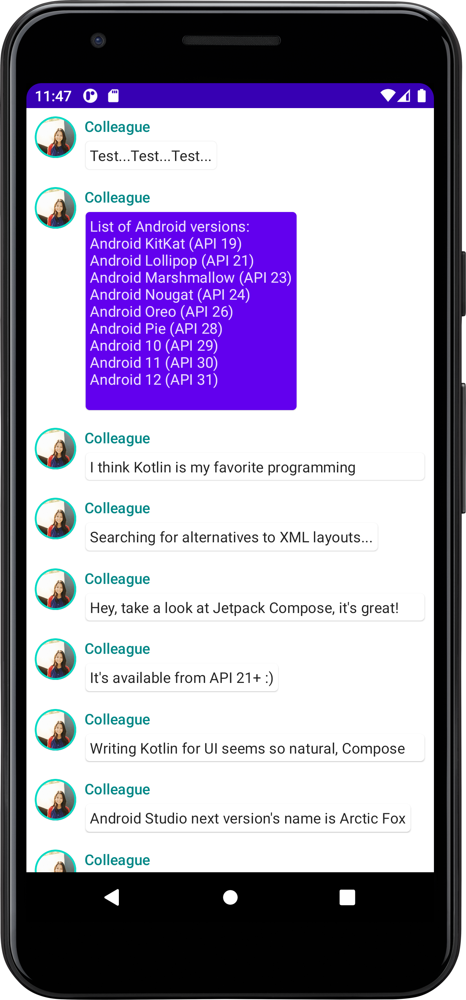

# ComposeTutorial
Jetpack Compose チュートリアル

# 環境
- macOS Monterey 12.5.1
- Android Studio 2021.2.1 Patch 2
- Kotlin 1.17.10
- API Level 30 Emulator

# 参考
- https://developer.android.com/jetpack/compose/tutorial?hl=ja
- https://gist.github.com/yrezgui/26a1060d67bf0ec2a73fa12695166436

# スクリーンショット

